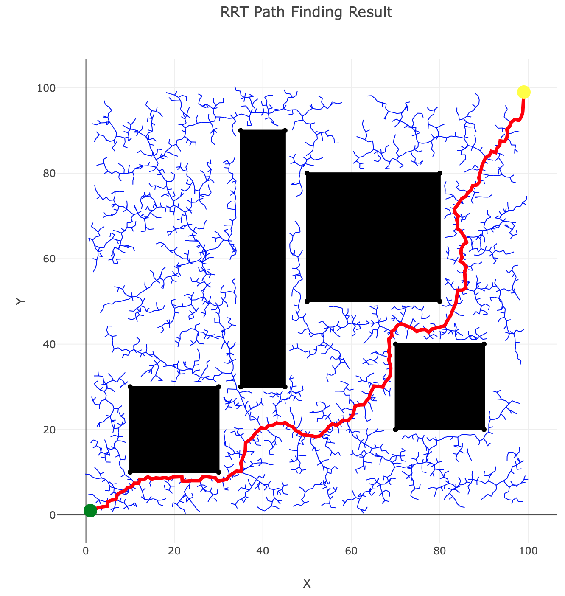

# Rust Planning

Personal project for motion planning and search algorithm implementations using Rust.

Currently has rough cut versions of both `RRT` and `RRT*`, as well as a basic HashTree structure for growing the trees.

### Example

Includes [an example](examples/world_example.rs) using a planar world with geometric obstacles built with the [Geo](https://crates.io/crates/geo) crate.
The library will attempt to find a path using either RRT or RRT* and plot the result using [Plotly](https://crates.io/crates/plotly).

To run regular RRT and return as soon as a path is found:
```
cargo run --example world_example -- 1.0 1.0 99.0 99.0 false
```


To run RRT*,
```
cargo run --example world_example -- 1.0 1.0 99.0 99.0 true
```


Or you can optionally specify a timeout to continue sampling to converge towards the optimal path,

```
cargo run --example world_example -- 1.0 1.0 99.0 99.0 true 10.0
```

