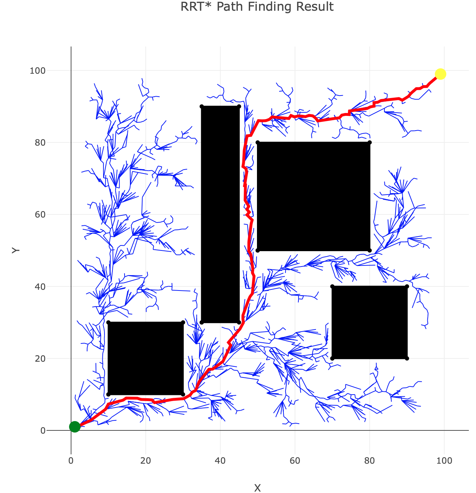

### Example

This [example](world_example.rs) uses a planar world with geometric obstacles built with the [Geo](https://crates.io/crates/geo) crate.
The library will attempt to find a path using RRT and plot the result using [Plotly](https://crates.io/crates/plotly).

To run regular RRT and return as soon as a path is found:
```
cargo run --example world_example -- 1.0 1.0 99.0 99.0 false false
```


To run RRT*,
```
cargo run --example world_example -- 1.0 1.0 99.0 99.0 true false
```


To run RRT-Connect:
```
cargo run --example world_example -- 1.0 1.0 99.0 99.0 false true
```


Or you can optionally specify a timeout to continue sampling to converge towards the optimal path,

```
cargo run --example world_example -- 1.0 1.0 99.0 99.0 true false 10.0
```

